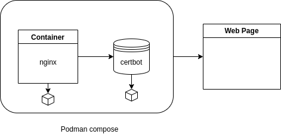

# Ejemplo de documentacion de proyecto
## Configurar un webserver con nginx y let's encrypt

Fuente:https://phoenixnap.com/kb/letsencrypt-docker

### Diagrama

### Pasos a seguir
* [Pasos](proeycto.md)
